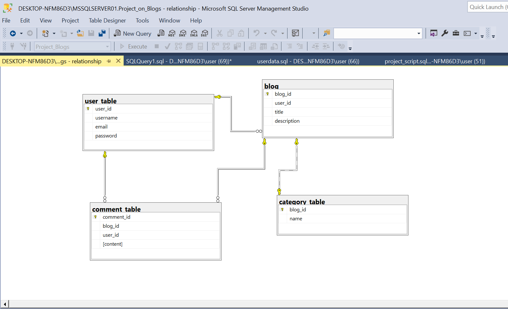

# Project Name: Database Setup and Configuration
<h2>Description:</h2>
This project focuses on creating a simple database using a popular database management system using Microsoft SQL Server. It covers basic configuration settings, including setting up a user, defining tables, and establishing basic relationships.

<h2>Steps I Followed:</h2>

<h3> Initial Setup</h3>
Install Microsoft SQL Server: Download and install SQL Server 2019 on your system.

<h3> Database Creation:  </h3>
   <b>Open SQL Server Management Studio (SSMS):</b> Launch SSMS to connect to the SQL Server instance. 
   <b>Create Database:</b> Use SSMS to create a new database named "Project_on_Blogs".

<h3>  User Management:</h3>
   Create Login: Execute SQL commands to create a login for database access:

    CREATE LOGIN myuser WITH PASSWORD = 'mypassword';

   Create User: Execute SQL commands to create a user for the database:

    USE SimpleDatabase;
    CREATE USER myuser FOR LOGIN myuser;

   Assign Role: Execute SQL commands to assign appropriate roles to the user:

    ALTER ROLE db_owner ADD MEMBER myuser;
    
Till now, we have completed defining the database schema and setting up user access, laying the foundation for our blogging application's data management system.

<h3> Table Definition:</h3>
Each table in our database represents a core entity within our blogging application. We'll provide detailed definitions for each table, including the columns they contain and their respective purposes.
The database schema for our blogging application consists of the following tables:

| Table Name | Columns                               | Description                              |
|------------|---------------------------------------|------------------------------------------|
| Users      | user_id (int), username (varchar(50)), email (varchar(50)), password (varchar(50)) | Stores information about registered users. |
| Blogs      | blog_id (int), user_id (int), title (varchar(50)), description (varchar(50)) | Stores information about blog posts.     |
| Categories | blog_id (int), name (varchar(50))    | Stores categories associated with blog posts. |
| Comments   | comment_id (int), blog_id (int), user_id (int), content (text) | Stores comments posted on blog posts.    |

Understanding the schema is crucial for defining tables, including their IDs, keys, and relationships. To facilitate this understanding, I am providing a diagram illustrating the overall schema of this project.

<h2>Establishing basic relationships</h2>
After creating the tables, we establish the following basic relationships within our database:

<h3>One-to-Many Relationship:</h3> 

<b>Users and Blogs:</b>
One user can create multiple blog posts.
Each blog post is associated with only one user.

<b>Blogs and Comments</b>
Multiple comments can be posted on a single blog post.
Each comment is associated with only one blog post.

<b>Users and Comments</b>
One user can post multiple comments.
Each comment is associated with only one user.

As I have assigned only one blog_id for both the blog and category_table, this implies a one-to-one relationship between blog posts and categories.

<h2>Conclusion:</h2>
In wrapping up, this project has walked us through the essential steps of setting up a robust database using Microsoft SQL Server. By creating a solid schema and establishing relationships between tables, we've laid a strong foundation for managing data effectively.

Understanding the basics of database setup and configuration is key to building reliable applications. With this project, we've gained valuable insights into user management, schema design, and establishing relationships between data entities.

<h5>
Interested in learning more about the project? Refer to the SQL script I provided in this repository for detailed actions and commands executed during the project.</h5>